# Claude Code (tengu) — Codebase Study Guide

> A guided tour of the ~300,000+ line TypeScript codebase that powers Claude Code, Anthropic's CLI AI coding assistant — an interactive terminal UI, Agent SDK, MCP ecosystem, remote session orchestrator, and subagent swarm platform.

---

## 1. Purpose — Why This Code Exists

**The problem:** Developers spend hours on repetitive mechanical tasks (reading files, searching code, running tests, editing patterns) that require intelligence but not deep creativity. Existing tools (Copilot, Cursor) offer inline completions but can't autonomously execute multi-step workflows — reading a bug report, searching the codebase for root cause, proposing a fix, running tests, and committing the result.

**The solution:** Claude Code is a **tool-using agent** that runs in the terminal. It reads your codebase, reasons about it, executes commands (bash, file reads/writes, git, grep), iterates based on results, and produces complete solutions. Unlike a code-completion tool, it operates at the task level — "fix this bug," not "complete this line."

**The internal codename is "tengu"** — you'll see this throughout event names (`tengu_startup_telemetry`), feature flags (`TENGU_SDK_BETA`), and internal identifiers.

**The competition context:** This codebase is the production CLI and SDK behind [Claude Code](https://claude.ai/code), running millions of sessions per month. It supports multiple backends (Anthropic API, AWS Bedrock, GCP Vertex, OpenAI-compatible proxies), multiple user interfaces (interactive TUI, headless SDK, MCP server), and multiple deployment models (local, remote/CCR, bridge).

> **Elaborative interrogation:** Before reading on — the codebase has 42+ Tool implementations. Why would a CLI coding agent need so many tools? Couldn't it just have "bash" and be done? What does having a dedicated `FileReadTool`, `FileWriteTool`, `FileEditTool` buy over raw bash?

---

## 2. Threshold Concepts

These three ideas, once grasped, make the entire codebase click:

### TC1: Everything flows through `query()`

The async generator `query()` at `resources/src/query.ts:307` is the **single execution loop** for every agent session. Whether you're using the interactive TUI, the headless SDK, a subagent, a coordinator, a bridge session, or a remote CCR session — your messages eventually flow through `query()`. It is an infinite `while(true)` generator that:

1. Applies compaction (snip → microcompact → context collapse → autocompact)
2. Sends messages to the LLM via `callModel()`
3. Executes tool calls from the LLM's response
4. Feeds tool results back into the loop as new messages
5. Handles errors (prompt-too-long, max-output-tokens) with escalating recovery

**Why this matters:** Understanding `query()` means understanding error recovery, compaction, streaming, and tool execution — because all of them happen in this single function. Every other system (subagents, SDK, MCP server) is a wrapper that sets up context and calls `query()`. If you only read one file, read `query.ts`.

### TC2: The Tool is the unit of extensibility

Every capability the agent has — reading files, running bash, editing code, searching, spawning subagents, writing todos — is a `Tool`. The `Tool` interface at `resources/src/Tool.ts` defines ~40 properties that govern:

- **Execution:** `call()`, `validateInput()`
- **Safety:** `isEnabled()`, `isReadOnly()`, `isConcurrencySafe()`, `isDestructive()`, `checkPermissions()`
- **Rendering:** `renderToolUseMessage()`, `renderToolResultMessage()`
- **Discovery:** `inputSchema`, `outputSchema`, `description()`
- **Optimization:** `shouldDefer` (tool search — don't send all schemas in every prompt)

Adding a feature to Claude Code = writing a new Tool implementation. Understanding how to build a Tool is understanding how to extend the agent. The 42+ tools in `tools/` are the best reference for how this works.

### TC3: Immutable state + diff-based notifications

The application state (`AppState`) is an immutable object managed by a custom Redux-like store at `state/store.ts`. Updates use the functional pattern: `setAppState(prev => ({ ...prev, messages: [...prev.messages, newMessage] }))`. The `Object.is` check prevents unnecessary renders.

The notification system (`state/onChangeAppState.ts`) works via **diffing**: subscribers register callbacks for specific state keys, and they're called only when those keys change. This means:
- Adding a message triggers file history updates, transcript recording, and hook execution — but NOT plugin reloading or settings sync
- Each side effect subscribes to only the state keys it cares about

> **Elaborative interrogation:** Why would a CLI tool use an immutable state store with diff-based notifications instead of just mutating a global object? What problems does this solve that mutation would cause?

---

## 3. System Map

How the 9 primary systems connect:

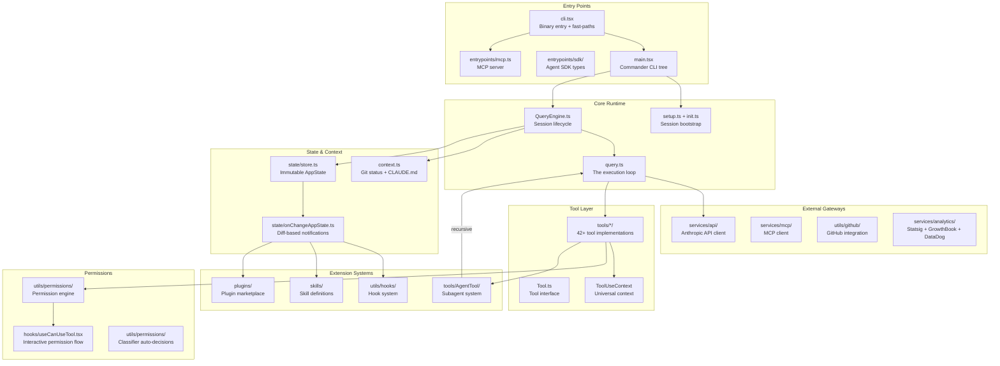

**Key edges to notice:**
- `AgentTool → query()`: subagents call the same execution loop recursively — full re-entrant design
- `query() → PERMS → CANUSE`: every tool execution passes through the permission system
- `ONCHANGE → HOOKS/SKILLS/PLUGINS`: state changes trigger extension systems
- **Every** interactive and non-interactive path converges on `query()`

---

## 4. Entry Points — How Execution Begins

**Purpose:** The art of getting the agent running — CLI parsing, session initialization, and the interactive/headless fork.

### 4.1 `entrypoints/cli.tsx` — The True Entry Point

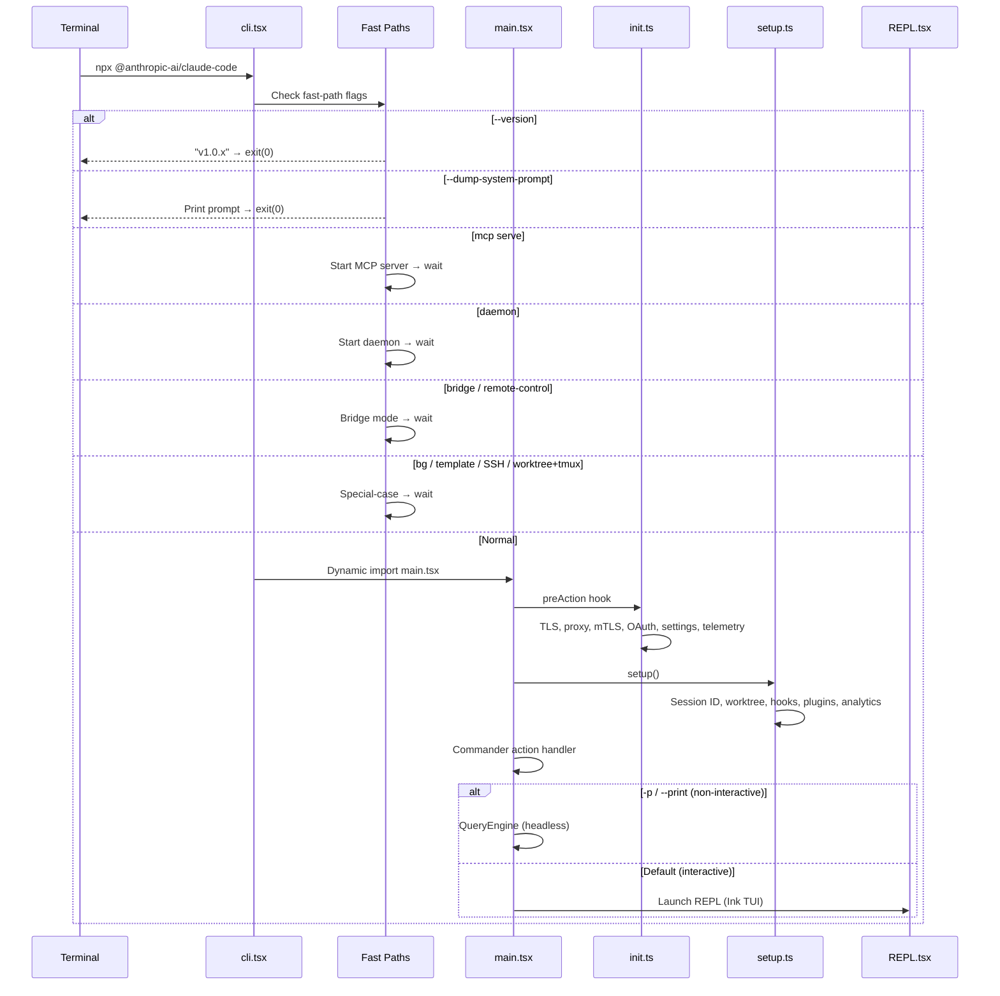

**Architectural pattern:** [Front Controller](https://en.wikipedia.org/wiki/Front_controller) — `cli.tsx` inspects the command and routes to the appropriate handler. Fast paths (version, daemon, bridge) exit early without importing the full main bundle, keeping startup fast.

### 4.2 `main.tsx` — The Commander CLI (~4000 lines)

Defines all CLI subcommands, flags, and the REPL launch flow. Key paths:

| Path | Trigger | What Happens |
|------|---------|-------------|
| `claude (no args)` | Default | Launches interactive REPL |
| `claude -p "fix this bug"` | `--print` | Headless mode → `QueryEngine.submitMessage()` |
| `claude mcp serve` | `mcp serve` | Starts MCP server on stdio |
| `claude --resume <session-id>` | `--resume` | Resumes a previous session |
| `claude --model opus-4-5` | Model override | Overrides default model |
| `claude connect <url>` | Direct connect | Opens a Connect URL session |

The `preAction` hook (runs before any command handler) calls `init()`:
```typescript
// main.tsx: early lines — Commander program setup
program.hook('preAction', async () => {
  await init({ argv: process.argv })
})
```

### 4.3 `setup.ts` — Session Bootstrap

```typescript
// setup.ts — the sequential initialization order matters
export async function setup(cwd, permissionMode, ...) {
  // 1. Node version check (>=18)
  // 2. Session ID + UDS messaging server
  // 3. Terminal backup restoration (iTerm2 / Terminal.app)
  // 4. setCwd(cwd) — CRITICAL: must happen before any cwd-dependent code
  // 5. Worktree creation (if --worktree + optional tmux)
  // 6. Background: session memory, context collapse, version lock
  // 7. Prefetch: commands, hooks, plugins, team memory
  // 8. Analytics init + tengu_started beacon
  // 9. API key prefetch
  // 10. Bypass permissions safety gate (root/Docker/network checks)
}
```

> **Why does `setCwd` have to happen first?** Nearly every subsequent system (git status, CLAUDE.md loading, plugin discovery, worktree creation) depends on knowing the working directory. All those systems call `getCwd()` from `bootstrap/state.ts`.

### Exploration task

1. **Predict:** What happens if you pass both `--version` and `-p "hello"`? Read `cli.tsx` to find the fast-path ordering.
2. **Investigate:** Open `setup.ts`. Find all the places where `isBareMode()` skips work. What kinds of initialization are skipped in bare mode, and why?
3. **Modify:** Add a log to `init()` that prints the session ID at startup. Use `getSessionId()` from `bootstrap/state.ts`.

---

## 5. The Execution Loop — `query.ts`

**Purpose:** The async generator at the heart of every agent interaction. One function, 1729 lines, infinite loop.

**Architectural pattern:** [Async Generator Coroutine](https://exploringjs.com/impatient-js/ch_async-iteration.html) — yields intermediate events to the caller, returns a `Terminal` object when done. This allows callers (REPL, SDK) to stream incremental progress.

### Loop structure

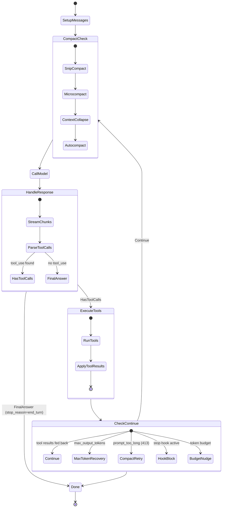

### Key code: the `continue` decisions

```typescript
// query.ts — after tool execution, multiple continuation paths
// Each path creates a new State object (immutable update)

// Normal continuation: tool results fed back as new messages
if (next_turn) {
  state = { messages: [...state.messages, ...toolResults], ... }
  continue // back to top of while(true)
}

// Recovery: model ran out of output tokens, escalating re-attempt
if (max_output_tokens_recovery) {
  state = { messages: [...], maxOutputTokens: nextSize, ... }
  continue
}

// Recovery: context was too long, try compacting and retry
if (reactive_compact_retry) {
  state = yield* compactAndRetry(state, error)
  continue
}

// Termination: model produced final answer
if (stop_reason === 'end_turn') {
  return terminal // ends the generator
}
```

### Error recovery hierarchy

| Error | Recovery Strategy | Escalation |
|-------|------------------|------------|
| `max_output_tokens` (model stopped early) | Re-send with doubled output token budget | 8K → 16K → 32K → 64K → multi-turn |
| `prompt_too_long` (413) | Snip compact → autocompact → reactive compact | Escalates through compaction stack |
| `tool_error` (non-fatal) | Log and continue with error message | N/A |
| `tool_error` (fatal, e.g. permission denied) | Stop agent, return terminal | N/A |

> **Elaborative interrogation:** Why does `query()` use an infinite loop with `continue`/`break` rather than a bounded `for` loop? What kinds of dynamic termination conditions can this handle that a fixed loop couldn't?

### Exploration task

1. **Predict:** The query loop processes `tool_use` blocks from the API response. What happens if the model responds with 5 tool calls at once vs 1 tool call per turn?
2. **Investigate:** Find where `StreamingToolExecutor` is used. How does parallel streaming tool execution work?
3. **Modify:** Find the `taskBudget` tracking in `query.ts`. What happens if you remove the `remaining` tracking?

---

## 6. Tool Architecture — The Unit of Extensibility

**Purpose:** Every agent capability is a Tool. Understanding the Tool interface is understanding how to extend Claude Code.

**Architectural pattern:** [Command Pattern](https://refactoring.guru/design-patterns/command) with a [Plugin Architecture](https://en.wikipedia.org/wiki/Plugin_pattern) — each tool is a self-contained module that the tool registry discovers and the execution loop invokes uniformly.

### Tool lifecycle

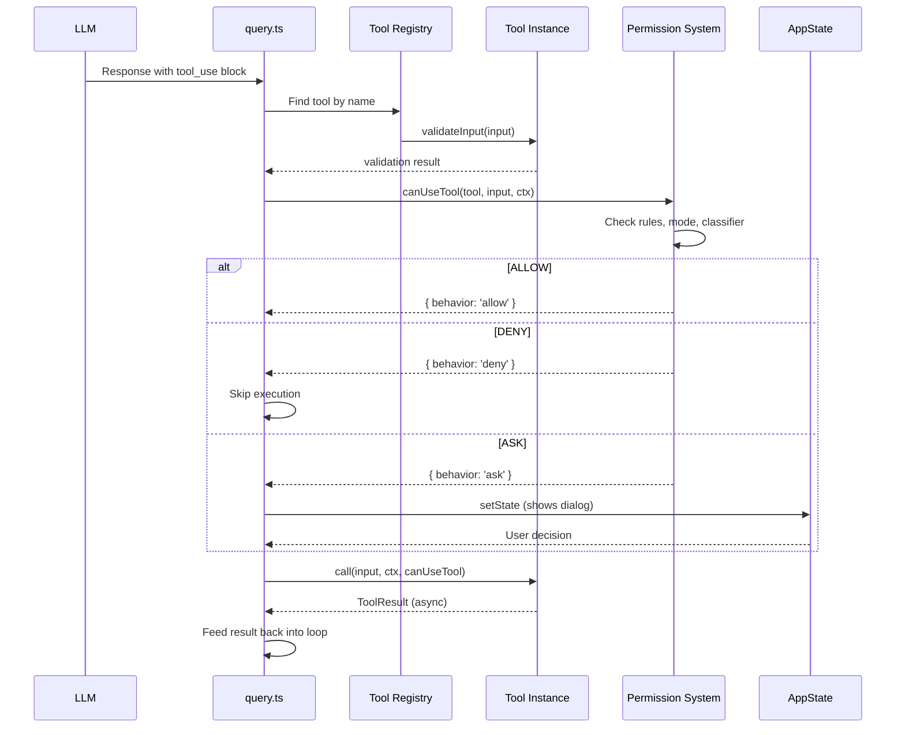

### The Tool interface (abridged)

```typescript
// Tool.ts — the full interface is ~40 properties
export interface Tool {
  name: ToolName
  call(input, context, canUseTool, parentMessage, onProgress): Promise<ToolResult>
  description(input?, options?): string
  inputSchema: ZodSchema
  isEnabled(): boolean
  isReadOnly(): boolean
  isConcurrencySafe(): boolean
  isDestructive(): boolean
  checkPermissions?(input, context): PermissionCheck
  validateInput(input, context): MaybePromise<ValidationResult>
  shouldDefer?: boolean        // Tool search: omit schema from initial prompt
  alwaysLoad?: boolean         // Override tool search
  maxResultSizeChars?: number  // Truncation threshold
  // ... ~30 more properties for rendering, MCP proxying, safety, etc.
}
```

### The four safety declarations

| Property | Meaning | Example |
|----------|---------|---------|
| `isReadOnly()` | Tool never modifies state | `FileReadTool` returns true |
| `isConcurrencySafe()` | Can run in parallel with other tools | `GrepTool` returns true |
| `isDestructive()` | Tool can cause permanent damage | `FileWriteTool` would return true |
| `isEnabled()` | Tool is available in current context | `MCPTool` returns false if server down |

### Tool creation pattern

```typescript
// Every tool uses this pattern (from tools/BashTool/BashTool.ts)
const bashTool: Tool = buildTool({
  name: ToolName.BASH,
  inputSchema: BashInputSchema,
  call: async (input, context, canUseTool) => {
    // 1. Validate environment
    // 2. Execute command
    // 3. Capture output
    // 4. Return ToolResult
  },
  isReadOnly: () => false,
  isConcurrencySafe: () => false,
  renderToolUseMessage: ({ toolUseID, input }) => (
    <BashToolUseMessage toolUseID={toolUseID} input={input} />
  ),
  async renderToolResultMessage({ content, outputType }) {
    return <BashToolResultMessage content={content} outputType={outputType} />
  },
})
```

> **Why three separate render functions?** `renderToolUseMessage` shows the tool invocation (e.g., "Running: `npm test`"), `renderToolUseProgressMessage` shows live progress (e.g., streaming output), and `renderToolResultMessage` shows the final result. The progress function exists because bash commands can run for minutes — users need live feedback.

### Tool search (deferred loading)

For performance, tool schemas are NOT all sent in every prompt. The `shouldDefer` flag controls this:

- Tools with `shouldDefer: true` are hidden from the initial prompt
- A meta-tool (`ToolSearchTool`) lets the LLM discover deferred tools by description
- This reduces prompt token count for sessions that don't use specialized tools
- Tool descriptions are cached by the prompt caching system at the `__SYSTEM_PROMPT_DYNAMIC_BOUNDARY__` marker

### Exploration task

1. **Predict:** Look at the `Tool` interface. If you wanted to add a `NotifySlackTool` that sends a message to Slack, which properties would you need to implement?
2. **Investigate:** Find the `isReadOnly()` declarations for 5 different tools. What makes `FileReadTool` read-only but `FileWriteTool` not?
3. **Modify:** Find a tool in `tools/`. Trace its `call()` method end-to-end. How does it get its `ToolUseContext`? Where does the abort controller come from?

---

## 7. State Management — Immutable AppState

**Purpose:** A single source of truth for all application state, updated immutably with diff-based notifications.

**Architectural pattern:** [Flux / Unidirectional Data Flow](https://facebook.github.io/flux/) — state flows down from the store, actions flow up through `setAppState()`, side effects trigger via `onChangeAppState`.

### The store

```typescript
// state/store.ts — minimalist Redux-like store (34 lines)
export function createStore<T>(initialState: T, onChange?: OnChange<T>): Store<T> {
  let state = initialState
  const listeners = new Set<Listener>()
  return {
    getState: () => state,
    setState: (updater: (prev: T) => T) => {
      const prev = state
      const next = updater(prev)
      if (Object.is(next, prev)) return  // No change → no re-render
      state = next
      onChange?.({ newState: next, oldState: prev })
      for (const listener of listeners) listener()
    },
    subscribe: (listener) => { listeners.add(listener); return () => listeners.delete(listener) }
  }
}
```

### The state shape (key sections)

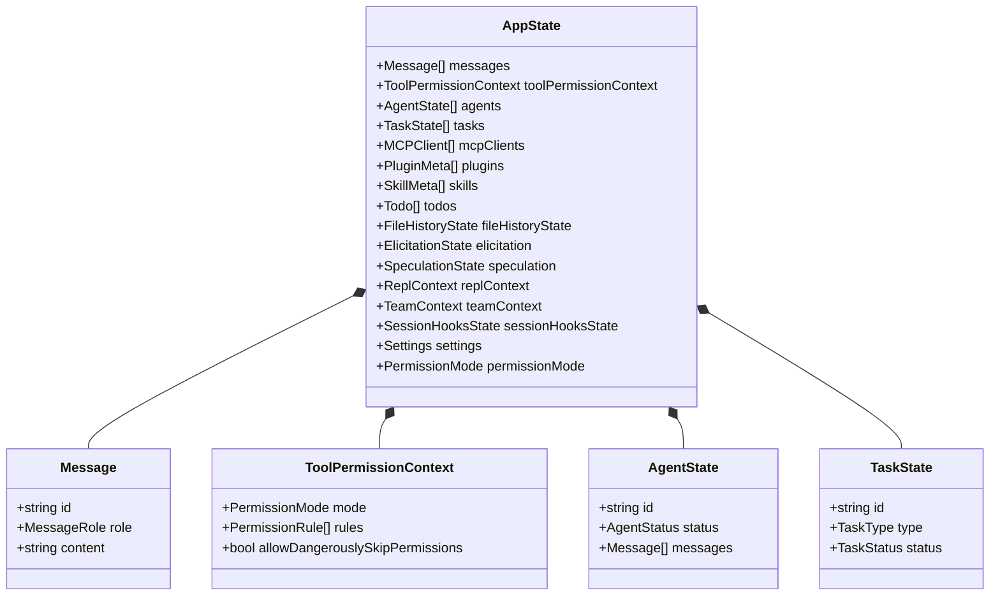

### The notification system

```typescript
// state/onChangeAppState.ts — diff-based callback dispatch
// Registers callbacks for specific state keys. Only fires when those keys change.
export const onChangeAppState = {
  onFileHistoryChange: (callback) => { /* fires only when fileHistoryState changes */ },
  onPluginChange: (callback) => { /* fires only when plugins change */ },
  onSkillChange: (callback) => { /* fires only when skills change */ },
  onMessageAdded: (callback) => { /* fires only when messages array changes */ },
  // ... ~30 more key-specific callbacks
}
```

**Why diff-based?** Without it, adding a single message would trigger plugin reloading, settings sync, team memory writes, file history updates, hook execution, and transcript recording — all at once, for every message. Diff-based notification means each subsystem only activates when its specific data changes.

### React integration

```typescript
// state/AppState.tsx — three hooks for different use cases
function useAppState(selector: (s: AppState) => T): T {
  // useSyncExternalStore — subscribe to store, only re-render when slice changes
}

function useSetAppState(): SetAppStateFn {
  // Stable reference — never causes re-renders when passed as a prop
}

function useAppStateMaybeOutsideOfProvider(): AppState | undefined {
  // Safe for components that may render outside the provider
}
```

> **Elaborative interrogation:** The store uses `Object.is(next, prev)` to skip notifications. When would this identity check fail to detect an actual change? (Hint: think about mutable fields on `AppState`.)

### Exploration task

1. **Predict:** If a component subscribes to `useAppState(s => s.todos)`, will it re-render when a new message is added to `messages`? Why or why not?
2. **Investigate:** Find a side effect that subscribes via `onChangeAppState`. What state key triggers it? What does it do when triggered?
3. **Modify:** Add a `console.log` to `store.ts` that prints every state update. Run a single prompt and observe how many state updates it generates.

---

## 8. Permission System

**Purpose:** Controls what tools the agent can use, when, and under what conditions. The permission system is the security boundary between the LLM and your machine.

**Architectural pattern:** [Chain of Responsibility](https://refactoring.guru/design-patterns/chain-of-responsibility) — permission checks pass through a sequence of deciders until one makes a final determination.

### Permission modes

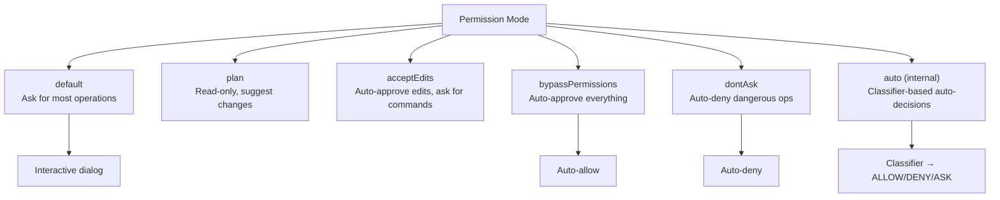

### Permission check flow

```typescript
// utils/permissions/permissions.ts — hasPermissionsToUseTool()
// The permission check runs through these layers in order:

// Layer 1: Runtime permission updates
if (toolPermissionContext.permissionUpdates) { /* apply updates */ }

// Layer 2: Bypass/dontAsk modes → auto-decide
if (mode === 'bypassPermissions') return { behavior: 'allow' }
if (mode === 'dontAsk' && tool.isDestructive()) return { behavior: 'deny' }

// Layer 3: Plugin restrictions
if (isRestrictedToPluginOnly(tool)) return { behavior: 'deny' }

// Layer 4: Rule-based matching
for (const rule of permissionRules) {
  if (ruleMatches(tool, input, rule)) return rule.decision
}

// Layer 5: Classifier (auto mode only)
if (mode === 'auto') return await classifyToolUse(tool, input)

// Layer 6: Fallback to interactive prompt
return { behavior: 'ask' }
```

### The bash classifier

For bash tools, a speculative classifier runs in parallel with a 2-second timeout:

```typescript
// utils/permissions/bashClassifier.ts
// Race: run classifier prediction against human decision timeout
// If classifier matches with high confidence before timeout → auto-approve
// If timeout fires first → show dialog to user
```

The classifier detects patterns like `npm test`, `git status`, `ls` (safe) vs `rm -rf`, `curl | sh`, `sudo` (dangerous).

### Rule sources (priority order)

| Priority | Source | Set By |
|----------|--------|--------|
| 1 (highest) | Session | CLI arguments, runtime decisions |
| 2 | CLI args | `--allowedTools`, `--disallowedTools` |
| 3 | Project | `.claude/settings.local.json` |
| 4 | User | `~/.claude/settings.json` |
| 5 | Plugin | Plugin manifest `permissions` field |
| 6 (lowest) | Enterprise | MDM-managed policy settings |

> **Elaborative interrogation:** The classifier only runs for bash tools, not file reads/writes. Why is this the right design? What would be different about classifying file operations?

### Exploration task

1. **Predict:** If you set `bypassPermissions` mode and run a tool that deletes files, what happens? What if you set `dontAsk` mode?
2. **Investigate:** Find the `dangerousPatterns.ts` file. What patterns are classified as dangerous for bash commands?
3. **Modify:** Add a custom permission rule in `~/.claude/settings.json` that auto-allows `npm test` but asks for everything else.

---

## 9. Subagent System — `tools/AgentTool/`

**Purpose:** Claude Code can spawn child agents that work on subproblems independently, then report back. This is how complex tasks get parallelized.

**Architectural pattern:** [Composite Pattern](https://refactoring.guru/design-patterns/composite) with [Recursive Design](https://en.wikipedia.org/wiki/Recursion_(computer_science)) — the agent contains agents that contain agents. Each subagent calls the same `query()` function as the parent.

### Subagent lifecycle

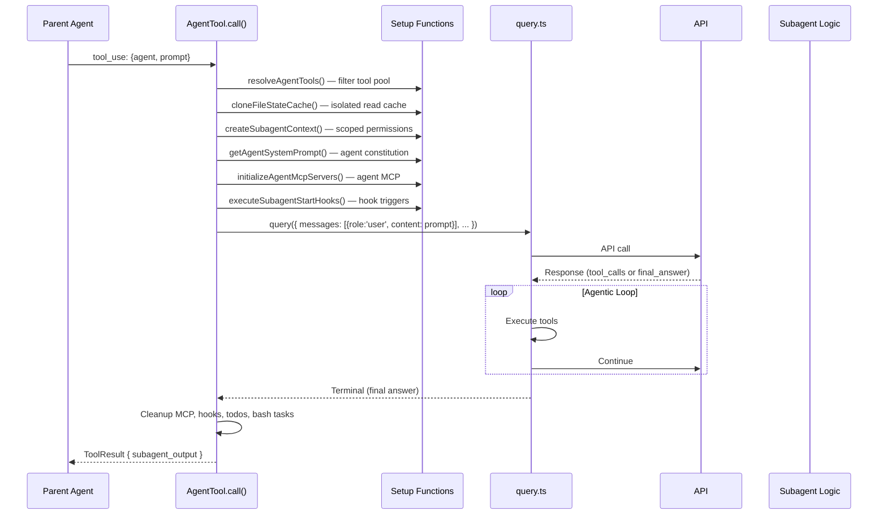

### Key: recursive `query()` calls

```typescript
// tools/AgentTool/runAgent.ts
// Subagents call the SAME query.ts function as the parent
import { query } from '../../query.ts'

export async function runAgent(params): Promise<AgentResult> {
  const context = createSubagentContext(parentContext, agentDef)
  // context has: scoped tools, isolated file cache, agent-specific MCP, own abort controller

  const stream = query({
    messages: [{ role: 'user', content: params.prompt }],
    systemPrompt: getAgentSystemPrompt(agentDef),
    toolUseContext: context,
    canUseTool: agentCanUseTool,
    // ...
  })

  for await (const event of stream) {
    // Forward events to parent, track output
  }

  return agentResult
}
```

### Fork subagents (prompt cache optimization)

Fork subagents (`useExactTools=true`) share the exact same tool pool and thinking config as the parent. This means the API request prefix is byte-identical → Anthropic's prompt caching gives cache hits. Forks are "cheap" subagents used for research/implementation isolation.

### Built-in agent types

The `tools/AgentTool/built-in/` directory contains default agent definitions:

| Agent | Purpose | Tool Set |
|-------|---------|----------|
| `general` | General-purpose subagent | Full tools |
| `explore` | Codebase exploration only | Read-only: Read, Grep, Glob |
| `plan` | Planning for complex tasks | Read-only + TodoWrite |

### Tool filtering

Agents can restrict which tools subagents have access to via `allowedTools` / `deniedTools` in agent definitions:

```yaml
# .claude/agents/explorer.md
---
name: explorer
description: Subagent for searching and understanding code
tools: Read, Grep, Glob, Bash
---
```

> **Elaborative interrogation:** Why do subagents call `query()` recursively rather than having their own separate execution loop? What are the costs and benefits of this design?

### Exploration task

1. **Predict:** If a subagent spawns another subagent, how deep does the recursion go? Is there a depth limit?
2. **Investigate:** Find `createSubagentContext()` in `AgentTool/`. What state is isolated vs shared between parent and subagent?
3. **Modify:** Create a new agent definition in `.claude/agents/` with a restricted tool set. Verify the subagent only has access to those tools.

---

## 10. MCP Integration

**Purpose:** Claude Code is both a MCP client (connecting to external MCP servers) and a MCP server (exposing its tools to other MCP clients). MCP is the protocol that lets Claude Code extend itself with community-built tools.

**Architectural pattern:** [Adapter Pattern](https://refactoring.guru/design-patterns/adapter) — MCP tools are wrapped as `MCPTool` instances that conform to the `Tool` interface, making them indistinguishable from built-in tools.

### As MCP client

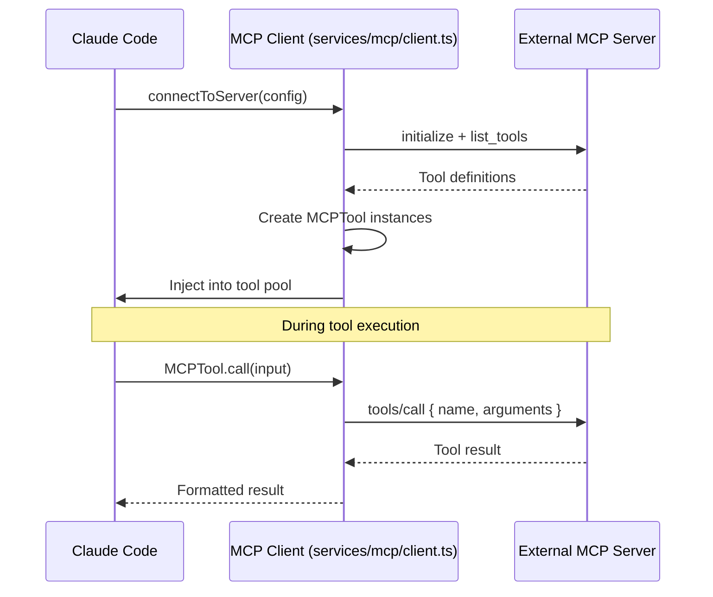

### As MCP server

```typescript
// entrypoints/mcp.ts
// Exposes Claude Code's tools TO other MCP clients
// Example: Cursor IDE connects to Claude Code as an MCP server,
//            gets access to BashTool, ReadTool, WriteTool, etc.
```

### Connection states

```typescript
type MCPServerConnection =
  | ConnectedMCPServer   // Live: tools, resources, prompts available
  | PendingMCPServer     // Connecting...
  | ErrorMCPServer       // Failed to connect
  | NeedsAuthMCPServer   // OAuth required
```

### Transport options

| Transport | Use Case |
|-----------|----------|
| `stdio` | Local subprocess: `uv run mcp-server` |
| `sse` | HTTP server-sent events: remote MCP server |
| `http` | Standard HTTP: REST-like MCP |
| `sdk` | IDE integration via `SdkControlTransport` |

### Exploration task

1. **Predict:** What happens if an MCP server returns a tool definition that conflicts with a built-in tool name?
2. **Investigate:** Read `services/mcp/client.ts`. How does `fetchToolsForClient()` handle tool schema conversion? What happens to MCP tool results that exceed `maxResultSizeChars`?
3. **Modify:** Add a local MCP server to your `~/.claude/mcp.json` config. Use `claude mcp list` to verify it's detected.

---

## 11. Hook & Plugin System

**Purpose:** Extensibility without forking. Hooks let you run code before/after tool execution, at session start/stop, and on state changes. Plugins bundle reusable hooks with permission manifests.

**Architectural pattern:** [Observer Pattern](https://refactoring.guru/design-patterns/observer) combined with [Event-Driven Architecture](https://en.wikipedia.org/wiki/Event-driven_architecture) — hooks subscribe to lifecycle events and execute custom logic.

### Hook types

| Hook | Fires When | Can Block? |
|------|-----------|------------|
| `PreToolUse` | Immediately before a tool executes | Yes (can deny) |
| `PostToolUse` | After a tool completes | No |
| `SessionStart` | At session initialization | Yes (can stop) |
| `SessionEnd` | At session termination | No |
| `PreCompact` | Before context compaction | No |
| `PostCompact` | After context compaction | No |
| `Notification` | External event triggers | N/A |
| `Stop` | User presses Esc | Yes (can block stop) |

### Hook execution flow

```typescript
// utils/hooks/hooks.ts — simplified
async function executePreToolUseHooks(tool, input, context) {
  for (const hook of getPreToolUseHooks()) {
    const result = await runHookScript(hook, {
      tool_name: tool.name,
      tool_input: input,
    })

    if (result.decision === 'block') {
      return { behavior: 'deny', reason: result.reason }
    }
    if (result.updatedInput) {
      input = result.updatedInput  // Hook can modify the input
    }
  }
  return { behavior: 'allow', input }
}
```

### Plugin manifest

```json
{
  "name": "my-plugin",
  "version": "1.0.0",
  "hooks": ["./hooks/pre-tool-use.sh"],
  "permissions": {
    "allow": ["Bash(npm test:*)"],
    "deny": ["Bash(rm *)"]
  }
}
```

> **Elaborative interrogation:** Hooks can modify tool input. What kinds of bugs could this introduce? How would you prevent a hook from accidentally breaking tool execution?

---

## 12. Context Compaction Stack

**Purpose:** LLM context windows are finite and expensive. The compaction stack manages context by progressively removing or summarizing old messages to keep the most relevant content in the prompt.

**Architectural pattern:** [Decorator Pattern](https://refactoring.guru/design-patterns/decorator) — each compaction strategy wraps the message list, removing or summarizing content.

### Compaction layers

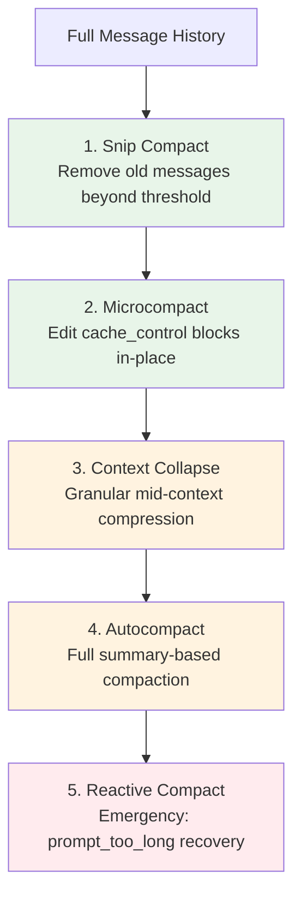

Green = cheap (no API call). Orange = moderate (some API work). Red = expensive (full summarization).

### The dynamic prompt boundary

```typescript
// constants/prompts.ts — the caching architecture
// Static prompt sections (above boundary) → cached with scope:'global'
// Dynamic sections (below boundary) → regenerated per-turn
const __SYSTEM_PROMPT_DYNAMIC_BOUNDARY__ = '__SYSTEM_PROMPT_DYNAMIC_BOUNDARY__'

// Consumed by services/api/ — splits prompt for Anthropic prompt caching
function splitSysPromptPrefix(fullPrompt: string): { prefix: string, suffix: string } {
  const idx = fullPrompt.indexOf(__SYSTEM_PROMPT_DYNAMIC_BOUNDARY__)
  return {
    prefix: fullPrompt.slice(0, idx),  // Cached globally (tools, identity, rules)
    suffix: fullPrompt.slice(idx),      // Session-specific (git context, memory)
  }
}
```

### Exploration task

1. **Predict:** After a long conversation (100+ messages), what compaction layers have fired? In what order?
2. **Investigate:** Find the autocompact logic. How does the summarization prompt work? What does it preserve vs discard?
3. **Modify:** Search for `autocompact` in `query.ts`. Find the threshold that triggers it. What happens if you lower it?

---

## 13. The `ToolUseContext` — The Universal Context Object

**Purpose:** Every tool invocation receives a `ToolUseContext` — an object carrying 40+ fields that provide everything a tool needs: the full tool registry, permission context, abort controller, MCP clients, file cache, and configuration.

**Architectural pattern:** [Context Object Pattern](https://en.wikipedia.org/wiki/Context_object) — bundles all environmental dependencies into a single passable object, avoiding global state.

### Key fields

```typescript
// Tool.ts — ToolUseContext (abridged)
interface ToolUseContext {
  // Core
  abortController: AbortController
  commands: Command[]              // All slash commands
  tools: Tool[]                    // All available tools
  mcpClients: MCPServerConnection[] // Active MCP servers

  // State access
  getAppState(): AppState
  setAppState(fn: SetAppStateFn): void

  // Permissions
  toolPermissionContext: ToolPermissionContext
  options: { permissionMode, ... }

  // Caches
  readFileStateCache: FileStateCache  // LRU cache for file reads
  modelInfoCache: ModelInfoCache      // Model capabilities
  settings: Settings                  // Merged settings

  // Platform
  platform: string
  cwdState: CwdState
  isInteractiveSession: boolean
  // ... ~20 more fields
}
```

### How it's created

1. **Main session:** Built at the top of `query()` from CLI args, settings, and bootstrap state
2. **Subagents:** `createSubagentContext()` in `AgentTool/` creates a *scoped* copy — same shape, but narrower permissions, different MCP clients, and a separate abort controller
3. **Coordinator:** `coordinatorMode.ts` creates a context with worker-management fields

> **Elaborative interrogation:** Why is `ToolUseContext` passed explicitly to every tool rather than being available as a module-level singleton? What testing and safety benefits does this provide?

---

## 14. Feature Flag System

**Purpose:** Experimental features can be gated behind flags that are eliminated from the bundle for external (non-employee) builds.

**Architectural pattern:** [Feature Toggle](https://martinfowler.com/articles/feature-toggles.html) with **compile-time dead code elimination** via `bun:bundle`.

### How it works

```typescript
// Anywhere in the codebase
import { feature } from 'bun:bundle'

if (feature('COORDINATOR_MODE')) {
  // This code is IN the employee binary, REMOVED from the public binary
  startCoordinatorMode(context)
}
```

The `feature()` function is a Bun macro — at build time, it replaces the call with `true` or `false` and dead-code-eliminates unreachable branches.

### Dynamic flag override

The GrowthBook integration (`services/analytics/growthbook.ts`) can override these at runtime for experiment groups, but only if the feature was compiled in.

### Exploration task

1. **Predict:** Search the codebase for `feature(` calls. How many experimental features are currently gated?
2. **Investigate:** Find a feature-gated code path. Trace what happens when you enable it at runtime via GrowthBook.
3. **Modify:** Find a `TODO` or `FIXME` near a feature flag. What work remains before this feature can graduate from flag to always-on?

---

## 15. Primary Flows — End-to-End Traces

### Flow 1: Interactive REPL session

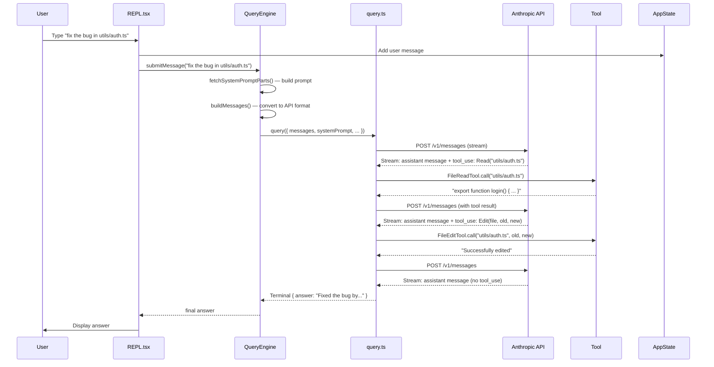

### Flow 2: Headless SDK mode

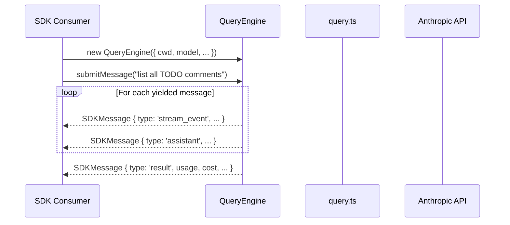

The SDK mode emits a different message set than interactive mode — no React rendering, no permission dialogs (auto-deny unless bypass), and structured result objects.

---

## 16. Architecture Decisions

### Why async generators for the execution loop?

Unlike Promises or callbacks, async generators provide backpressure — the caller controls the pace of iteration. This means the REPL can pause to show a permission dialog, the SDK can buffer events, and subagents can intercept tool calls. A promise-based API would force fire-and-forget semantics.

### Why `Object.is` identity check in the store?

React's reconciliation uses reference equality. By returning the same object when nothing changed, `Object.is` prevents unnecessary re-renders without requiring `React.memo` or `shouldComponentUpdate` on every component.

### Why recursive `query()` for subagents?

Building a separate execution loop for subagents would mean maintaining two copies of the compaction, error recovery, tool execution, and streaming logic. Recursive reuse means every improvement to `query()` benefits both parent and subagent sessions.

### Why all-VARCHAR in the pipeline code, but typed schemas in resources/src?

The pipeline code (FahMai competition) loads CSV data as all-VARCHAR to handle messy real-world data. `resources/src` defines strict Zod schemas for all tool inputs/outputs — because tools are the API contract between the LLM and the system, and strict typing prevents malformed tool calls from corrupting state.

### Why regex-based guardrails in the pipeline but classifier-based permissions in resources/src?

The pipeline uses simple regex for injection detection because it only needs to block adversarial prompts. `resources/src` uses a sophisticated classification system because it needs to make nuanced decisions about which bash commands, file operations, and network accesses are safe in diverse environments.

---

## 17. Codebase Conventions

### `lazySchema()` — deferred schema creation

```typescript
// Instead of:
const mySchema = z.object({ field: z.string() })  // Runs at import time

// Use:
const mySchema = lazySchema(() => z.object({ field: z.string() }))  // Runs on first use
```

Zod schema instantiation can be expensive. `lazySchema()` (defined in `utils/`) defers creation until first access, reducing cold-start time for the CLI.

### `bun:bundle` conditional compilation

The codebase uses Bun as both runtime and bundler. `import { feature } from 'bun:bundle'` creates compile-time feature flags that are dead-code-eliminated in builds.

### Void for fire-and-forget

```typescript
// Transcript writes, analytics, and hook execution use void to
// avoid blocking the main execution loop
void recordTranscript(message)
void sendAnalyticsEvent('tengu_tool_used', { tool })
```

### Error messages as teaching tools (in-band guidance)

Every tool returns hints with error messages that guide the LLM toward the next action:

```
"File 'src/config.ts' not found. Use Glob('**/config*') to search for similar files."
"SQL Error: column 'xyz' not found. Hint: Use explore_schema() to check column names."
```

### Naming conventions

- **Files:** PascalCase for components/tool directories, camelCase for utilities
- **Functions:** `get*` for accessors, `fetch*` for async fetchers, `use*` for React hooks
- **Types:** PascalCase, prefixed with domain: `ToolUseContext`, `PermissionDecision`, `TaskState`
- **Internal codename:** `"tengu"` appears in event names, feature flags, and internal identifiers

---

## 18. Exploration Tasks — Independent Investigation

Complete these to test your understanding:

### Task A: Trace a tool addition

Design a new tool called `JiraTool` that creates Jira issues from bug reports. Answer:

1. What goes in the `inputSchema`?
2. What goes in `call()`? What external service does it call?
3. What safety declarations (`isReadOnly`, `isDestructive`, `isConcurrencySafe`)?
4. How would you register it in the tool registry?
5. What render functions would you need?

Check your design against the existing `GhIssueTool` or similar tools.

### Task B: Trace a compaction bug

A user reports that after 200+ messages, the agent "forgets" about a file it read 50 messages ago. Trace through the compaction layers:

1. When would snip compaction fire?
2. When would autocompact fire?
3. What determines which messages survive compaction?
4. How would you verify your hypothesis?

### Task C: Understand state flow

Start at `REPL.tsx`, trace a single user message all the way to the API call and back:

1. Where is the message added to `AppState`?
2. Where does the API call happen?
3. Where do tool results get added to state?
4. Where does the final answer get rendered?
5. How many state updates happen in total?

### Task D: Model the permission decision

Given the configuration:
```json
{
  "permissions": {
    "allow": ["Bash(npm test:*)"],
    "deny": ["Bash(rm *)"],
    "defaultMode": "default"
  }
}
```

For each of these tool uses, trace the exact decision path:
1. `Bash("npm test -- --watch")`
2. `Bash("rm -rf node_modules")`
3. `Bash("npm install")`
4. `FileRead("package.json")`

---

## 19. Quick Reference

### File map

| File | Lines | Purpose | Key Function |
|------|-------|---------|-------------|
| `query.ts` | 1729 | Main execution loop | `query()` |
| `QueryEngine.ts` | 1295 | Session lifecycle + SDK | `submitMessage()` |
| `Tool.ts` | 792 | Tool interface + ToolUseContext | `Tool` type, `buildTool()` |
| `Task.ts` | 125 | Background task types | `TaskType`, `TaskStatus` |
| `main.tsx` | ~4000 | CLI command tree | Commander program |
| `setup.ts` | 477 | Session initialization | `setup()` |
| `context.ts` | ~200 | System/user context | `getSystemContext()` |
| `state/store.ts` | 34 | Immutable store | `createStore()` |
| `state/AppStateStore.ts` | 569 | Full state shape | `AppState` type |
| `state/onChangeAppState.ts` | ~300 | Diff-based notifications | `onChangeAppState` |
| `constants/prompts.ts` | 914 | System prompt assembly | Factory functions |
| `services/api/claude.ts` | 3419 | API client | `callModel()` |
| `services/mcp/client.ts` | 3348 | MCP client | `connectToServer()` |
| `tools/AgentTool/runAgent.ts` | 973 | Subagent lifecycle | `runAgent()` |
| `utils/permissions/permissions.ts` | 1486 | Permission engine | `hasPermissionsToUseTool()` |

### Key directories

| Directory | Contains |
|-----------|----------|
| `entrypoints/` | All program entry points |
| `tools/` | 42+ tool implementations |
| `commands/` | 50+ slash command handlers |
| `components/` | 144+ React TUI components |
| `hooks/` | 85+ React hooks |
| `utils/` | 329+ utility modules (permissions, git, hooks, plugins, telemetry, sandbox, swarm, settings, etc.) |
| `services/` | External service integrations (API, MCP, analytics, OAuth, LSP, plugins) |
| `state/` | Application state management |
| `constants/` | 21 constant/config modules |
| `remote/` + `bridge/` | Remote session and bridge infrastructure |
| `schemas/` | Zod schemas |

### Key dependencies

| Dependency | Role |
|-----------|------|
| `ink` | React-for-terminal UI framework |
| `zod` | Schema validation for tool inputs/outputs |
| `axios` | HTTP client for API calls |
| `commander` | CLI argument parsing |
| `bun` | Runtime + bundler (`bun:bundle` feature flags) |
| `@anthropic-ai/sdk` | Anthropic API streaming and types |
| `@modelcontextprotocol/sdk` | MCP client/server protocol |

---

*This guide was generated from the Fahmai_Finale `resources/src/` codebase. Re-generate after significant refactors to keep it current.*
