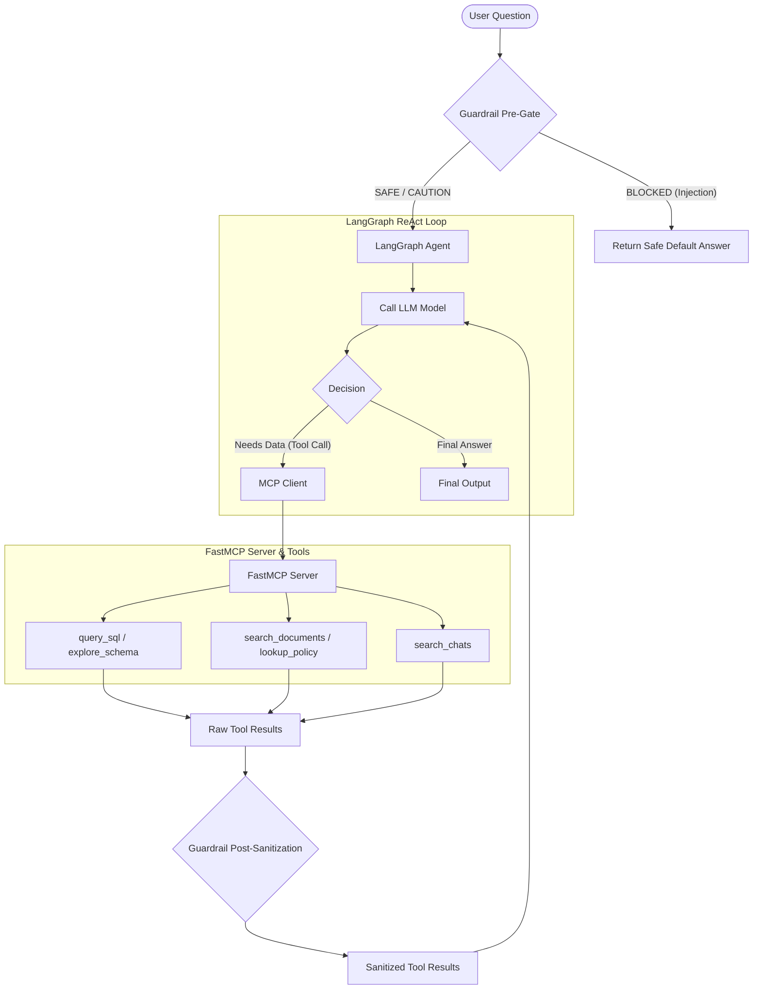

# FahMai: The Finale — Enterprise Data Agentic Showdown

A state-of-the-art **LangGraph-powered LLM agent** designed to answer complex, cross-domain business queries about **FahMai** (ฟ้าใหม่), a leading multi-channel electronics retailer in Thailand.

The agent operates like an expert human analyst: it dynamically explores schemas, constructs precise DuckDB SQL queries, searches company emails/memos, scans over **53,000+ customer and internal chat transcripts**, and reconciles accounts. The entire system is decoupled using the **Model Context Protocol (FastMCP)** and secured with a **dual-layer, zero-trust guardrail**.

## Table of Contents
1. [Project Overview](#project-overview)
2. [Key Features](#key-features)
3. [Tech Stack](#tech-stack)
4. [Prerequisites](#prerequisites)
5. [Getting Started](#getting-started)
6. [Architecture Overview](#architecture-overview)
7. [Database Schema and SQL Conventions](#database-schema-and-sql-conventions)
8. [Environment Variables](#environment-variables)
9. [Available Scripts](#available-scripts)
10. [Testing](#testing)
11. [Deployment](#deployment)
12. [Troubleshooting](#troubleshooting)

---

## Project Overview

FahMai's agent architecture handles complex enterprise inquiries spanning operations, finances, customer support, and vendor partnerships. By combining semantic keyword search over thousands of unstructured markdown transcripts and dynamic SQL generation over structured transaction ledgers, the system reconciles data streams to guarantee robust enterprise-grade business analytics.

## Key Features

- **Decoupled Architecture**: Reasoning (LangGraph Agent) is separated from capabilities (MCP Tools) using the Model Context Protocol.
- **Zero-IO Chat Search**: High-performance in-memory indexing pre-filters and searches 53k+ customer and internal chat threads in milliseconds without hitting disk per query.
- **Dual-Layer Zero-Trust Guardrail**: Strips Cyrillic homoglyphs and leetspeak to prevent prompt injections, utilizes an LLM Judge for ambiguous threats, and sanitizes tool outputs before LLM consumption.
- **Analytics Warehousing**: Embedded DuckDB engine dynamically parses and queries 31 relational CSV files covering two years of retail operations.
- **Robust Verification Suite**: Comprehensive integration testing (43 unit/MCP tests) ensuring schema mapping, policy compliance, and tool safety.

---

## Tech Stack

- **Language**: Python 3.10+
- **Agent Framework**: LangGraph 0.2+ (ReAct-style cyclic tool-calling)
- **Decoupling Protocol**: FastMCP (mcp) 1.0+ (stdio and SSE servers)
- **Database Engine**: DuckDB 1.1+ (high-speed in-memory data warehouse loading dimensions and facts)
- **APIs**: OpenAI API (AsyncOpenAI client using `gpt-4o-mini` by default)
- **HTTP Server**: FastAPI 0.115+ and Uvicorn 0.30+ (for back-test evaluation routes)
- **CLI Utilities**: Rich (elegant terminal tables and progress loops)
- **Testing**: pytest 8.0+

---

## Prerequisites

- **Python 3.10 or higher**
- **OpenAI API Key** (or Wafer API proxy key)
- **Kaggle CLI or kagglehub package** (optional, to download raw competition data)

---

## Getting Started

### 1. Clone the Repository
```bash
git clone https://github.com/temicide/Fahmai_Finale.git
cd Fahmai_Finale
```

### 2. Install Python Dependencies
Set up your virtual environment and install all packages:
```bash
python -m venv .venv
source .venv/bin/activate
pip install -r pipeline/requirements.txt
```

### 3. Environment Setup
Copy the template configuration file to your pipeline directory:
```bash
cp pipeline/.env.example pipeline/.env
```
Edit `pipeline/.env` and specify your credentials:
```env
OPENAI_API_KEY=your_openai_api_key_here
LLM_MODEL=gpt-4o-mini
```

### 4. Download Competition Data (~2 GB)
Execute the helper script to fetch the retail operation datasets (memos, policies, database tables, and chats):
```bash
python download_data.py
```

### 5. Run the Agent CLI
The pipeline includes multiple run modes:

```bash
# Run Demo Mode (runs 6 representative questions covering EASY to XHARD)
python pipeline/pipeline.py

# Run Full Evaluation (runs all 240 questions from questions.csv)
python pipeline/pipeline.py --all

# Run subset by difficulty (EASY, MED, HARD, XHARD)
python pipeline/pipeline.py --subset HARD

# Run a specific question by ID
python pipeline/pipeline.py --id L3-Q-EASY-001

# Run a custom free-form question
python pipeline/pipeline.py -q "What was FahMai's total revenue in 2025?"

# Run with verbose logs showing tool execution and agent reasoning
python pipeline/pipeline.py --verbose

# Export results for submission
python pipeline/pipeline.py --all --output submission.csv
```

### 6. Start the FastAPI HTTP Server
Start the back-testing API to handle incoming evaluator requests:
```bash
python pipeline/server.py
```
This boots the server at `http://localhost:8000`. You can change the port with the `PORT` environment variable.

---

## Architecture Overview



### Request Lifecycle

1. **Guardrail Pre-Assessment**: The user's query is intercepted by the Pre-Gate. Text is normalized and evaluated for prompt injection signatures.
2. **LangGraph Agent Loop**: Safe queries enter `call_model` which initiates the ReAct cycle.
3. **MCP Client Interactivity**: If the LLM requests data, the LangGraph node routes it through `FahMaiMCPClient` using stdio transport.
4. **FastMCP Server Dispatch**: The server processes arguments and triggers the backend python tools (`explore_schema`, `query_sql`, etc.).
5. **Guardrail Post-Sanitization**: Raw tool results are scanned for instructions/prompts before they reach the LLM. Redactions are made if necessary and a safety header is applied.
6. **Agent Output Resolution**: The agent processes the sanitized dataset and returns the final concise answer.

---

## Database Schema and SQL Conventions

The DuckDB operational database pre-loads 31 CSV tables on boot. These tables represent two years of retail operations from **2024-01-01** to **2025-12-31**.

### Key Dimension and Fact Tables

| Table Category | Table Name | Key Columns | Purpose |
| :--- | :--- | :--- | :--- |
| **Sales** | `"FACT_SALES"` | `sales_transaction_id`, `customer_id`, `net_total_thb`, `discount_total_thb` | Sales invoice and order aggregates |
| **Sales** | `"FACT_SALES_LINE_ITEM"` | `line_item_id`, `sales_transaction_id`, `sku_id`, `quantity`, `unit_price_thb` | Detail rows for purchased items |
| **Inventory** | `"FACT_INVENTORY_MOVEMENT"`| `movement_id`, `sku_id`, `movement_qty`, `movement_type`, `business_event_date` | Stock levels tracking |
| **Inventory** | `"FACT_INVENTORY_SNAPSHOT"`| `snapshot_month`, `sku_id`, `ending_on_hand_qty` | Monthly inventory status snapshots |
| **Returns** | `"FACT_RETURN"` | `return_transaction_id`, `sales_transaction_id`, `refund_status` | Customer return and refund tickets |
| **Finance** | `"FACT_BANK_TRANSACTION"` | `transaction_id`, `account_id`, `amount_thb`, `transaction_class` | Bank deposit, withdrawal, and fee log |
| **Finance** | `"FACT_PAYROLL"` | `payroll_id`, `employee_id`, `net_pay_thb`, `business_event_date` | Salary disbursements |
| **Customers** | `"DIM_CUSTOMER"` | `customer_id`, `email`, `loyalty_tier`, `created_at` | Customer information profiles |
| **Products** | `"DIM_PRODUCT"` | `sku_id`, `product_name`, `msrp_thb`, `brand` | Catalog database |
| **Partners** | `"DIM_VENDOR"` | `vendor_id`, `vendor_name`, `payment_terms_days` | Vendor details |
| **Partners** | `"DIM_VENDOR_CONTRACT"` | `contract_version_id`, `vendor_id`, `effective_date`, `end_date` | Active vendor agreements |

### Key Rules for SQL Query Construction

> [!IMPORTANT]
> **To prevent runtime errors, you MUST follow these four rules during SQL construction:**
> 1. **Case-Sensitivity**: Table names and column names must match the CSV headers exactly and **MUST BE DOUBLE QUOTED** (e.g., `SELECT * FROM "FACT_SALES"` instead of `SELECT * FROM fact_sales`).
> 2. **Type Casting for Math**: All numerical fields (such as prices, weights, amounts) are loaded as `VARCHAR`. **ALWAYS CAST them to `DECIMAL`** before performing mathematical operations (e.g., `SUM(CAST(net_total_thb AS DECIMAL))` or `CAST(unit_price_thb AS DECIMAL) > 500`).
> 3. **Temporal Filtering**: Always filter dates using the `business_event_date` column in ISO 8601 format (`YYYY-MM-DD`). Avoid using `effective_date` or `as_of_date` since they represent metadata and are frequently null.
> 4. **Bank Transaction Classes**: The `"FACT_BANK_TRANSACTION"` table defines transactions using the class keywords `'deposit'`, `'withdrawal'`, `'transfer'`, and `'fee'`. Do not use `'credit'` or `'debit'`.

---

## Environment Variables

### Required Variables

| Variable | Description | Value Example |
| :--- | :--- | :--- |
| `OPENAI_API_KEY` | Your OpenAI developer key (or Wafer API key) | `sk-proj-4a...` |

### Optional Variables

| Variable | Description | Default Value |
| :--- | :--- | :--- |
| `LLM_MODEL` | The language model version used for agent reasoning | `gpt-4o-mini` |
| `OPENAI_BASE_URL` | Alternate gateway URL for proxies or local mock servers | `https://api.openai.com/v1` |
| `FAHMAI_DATA_DIR` | Absolute or relative path to the extracted data bundle | `./fah-mai-the-finale-enterprise-data-agentic-showdown` |

---

## Available Scripts

The project includes multiple scripts to manage execution, testing, and operations:

| Command | File Path | Description |
| :--- | :--- | :--- |
| **Run Agent CLI** | `pipeline/pipeline.py` | Command line interface to invoke, analyze, and test queries. |
| **Back-test API Server** | `pipeline/server.py` | FastAPI HTTP web server running evaluation tracks. |
| **FastMCP Tool Server** | `pipeline/mcp_server.py` | Starts the FastMCP tool server via stdio transport or SSE. |
| **Data Fetcher** | `download_data.py` | Uses Kagglehub to download the competition data package. |
| **Test Suite** | `pipeline/tests/` | Run unit and integration tests under the pytest framework. |

---

## Testing

The project uses `pytest` to verify components, guardrails, and FastMCP protocol formatting.

### Running Tests
Execute the commands below inside the virtual environment:

```bash
# Run the entire test suite (43+ tests)
pytest pipeline/tests/ -v

# Run only tool unit tests
pytest pipeline/tests/test_tools.py -v

# Run only MCP protocol structure tests
pytest pipeline/tests/test_mcp.py -v
```

### Writing a New Test
Add unit tests inside `pipeline/tests/test_tools.py` using standard pytest conventions. Import tools directly from `tools.py`:

```python
from tools import query_sql, explore_schema

def test_custom_sql():
    result = query_sql("SELECT count(*) FROM \"DIM_PRODUCT\"")
    assert "count" in result.lower()
```

---

## Deployment

The system is fully self-contained and handles database parsing in memory. It can be deployed in three modes:

### 1. FastMCP Tool Server over SSE (for Desktop Integrations)
To serve the tool suite to secondary client environments (like Claude Desktop or MCP Inspector):
```bash
python pipeline/mcp_server.py --sse --port 8765
```

### 2. FastAPI Back-test Server (for Evaluator Scripts)
Start the FastAPI HTTP endpoints to receive questions on `/agent/local` and `/agent/thaIllm`:
```bash
PORT=8000 python pipeline/server.py
```

### 3. Docker Containerization
To deploy as a microservice on cloud environments, use the following `Dockerfile` outline:
```dockerfile
FROM python:3.10-slim

WORKDIR /app

# Install system dependencies
RUN apt-get update && apt-get install -y libpq-dev build-essential && rm -rf /var/lib/apt/lists/*

# Install python requirements
COPY pipeline/requirements.txt .
RUN pip install --no-cache-dir -r requirements.txt

# Copy source and data
COPY pipeline/ ./pipeline/
COPY download_data.py .
COPY questions.csv .

# Download data package during build or run mount
RUN python download_data.py

EXPOSE 8000

ENV PORT=8000
CMD ["python", "pipeline/server.py"]
```

---

## Troubleshooting

### 1. DuckDB Connection Issues
- **Error**: `could not connect to server: Connection refused` or `Table not found`
- **Solution**: The database loads dimensions and facts dynamically from tables folder. Ensure the tables exist by validating the `FAHMAI_DATA_DIR` path in your `.env`. Verify paths via `python download_data.py`.

### 2. SQL Syntax / Double Quoting Errors
- **Error**: `SQL Error: Table 'FACT_SALES' not found`
- **Solution**: Table names are case-sensitive and must match CSV stems. Ensure you wrap the table inside double-quotes, for example `"FACT_SALES"` in your queries.

### 3. Math Aggregations Returning Zero
- **Error**: `SUM(amount_thb)` returns `0` or unexpected text mismatches
- **Solution**: Columns are stored as `VARCHAR`. Make sure you cast variables using `CAST(column_name AS DECIMAL)` before doing aggregate math.

### 4. FastMCP Server Timeouts / SSE Transport Fails
- **Error**: SSE server fails to bind or stdio socket disconnects
- **Solution**: Verify the specified port is not already occupied by another service (`lsof -i :8765`). If using stdio, make sure no debug prints output to standard stdout from tools layer since they interfere with the MCP protocol.

### 5. Guardrail False Positives
- **Error**: Safe query marked as `BLOCKED`
- **Solution**: The Zero-Trust Pre-Gate scans query strings with 23 weighted English and Thai regex definitions. If a technical query is flagged, check the normalised text output inside CLI console logs or check the specific pattern matched. The secondary `LLM Judge` will automatically audit queries flagged in the `SUSPICIOUS` tier (score 0.65–0.85).

---
*Last reviewed and updated: 2026-06-02*
